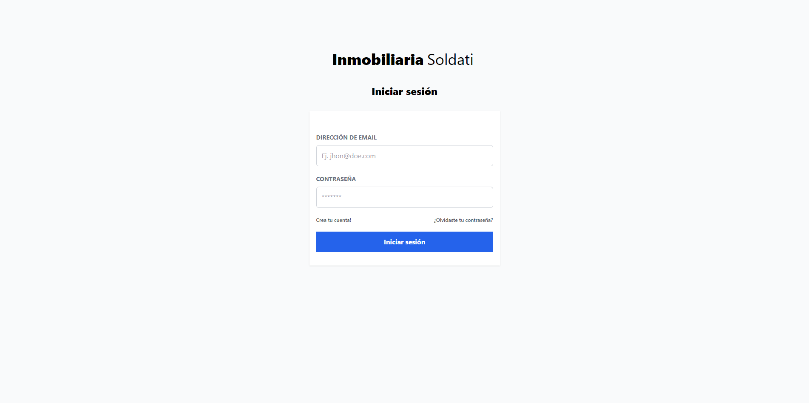
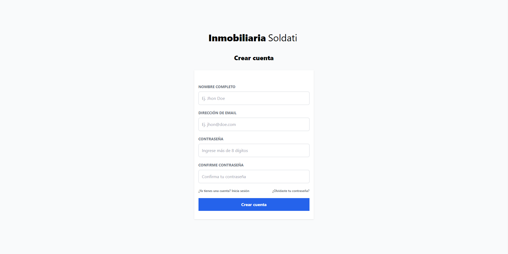
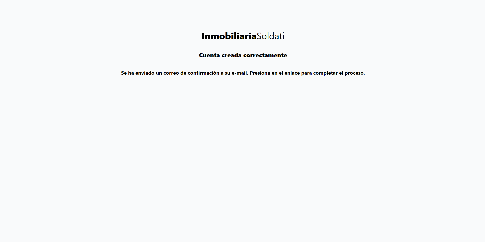
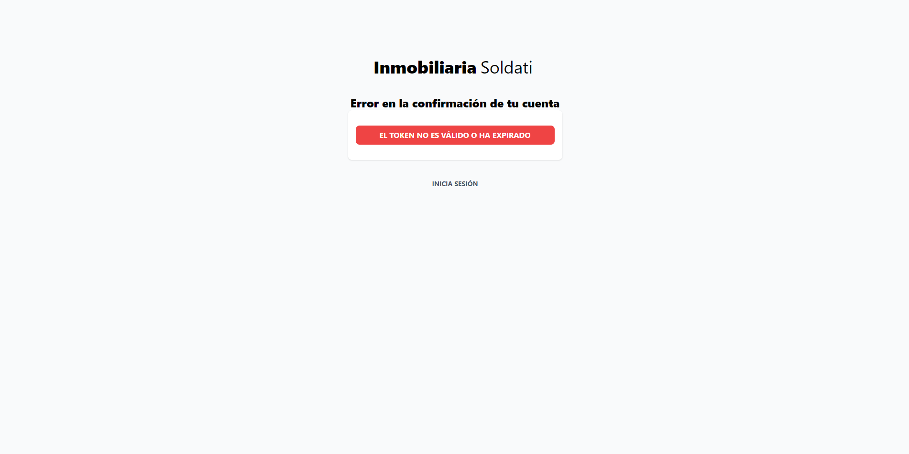

# Inmobiliaria Soldati

Aplicación web para la gestión de inmuebles de la inmobiliaria Soldati.

## Preview

### Log In

### Sign Up

### Confirm Account

### Handling errors

## Stack
- pug
- node
- express
- tailwind
- bcrypt
- sequelize
- MySQL

## Instalación
1. Clonar el repositorio
2. Instalar las dependencias con `npm install`
3. Crear un archivo `.env` en la raíz del proyecto con las variables de entorno del archivo `.env.example`
4. Crear la base de datos con el nombre que se haya configurado en el archivo `.env`
6. Ejecutar el servidor con `npm run dev`
7. Ingresar a `localhost:3000` en el navegador
5. Importar los datos con el comando node `./seed/seeder.js -i` (opcional)
9.  Listo!